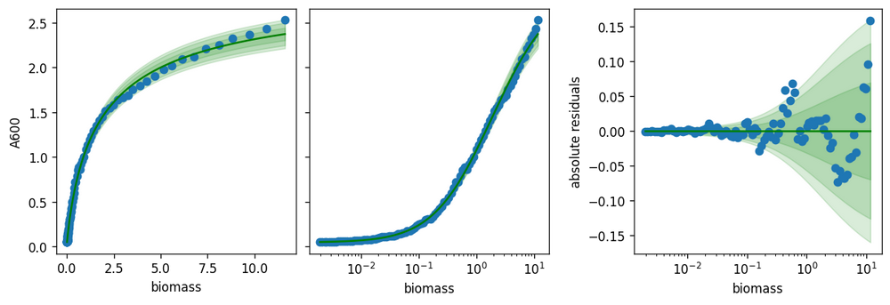
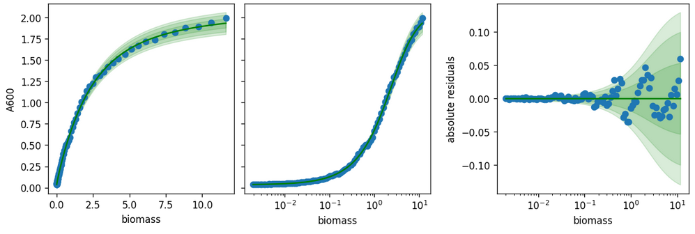
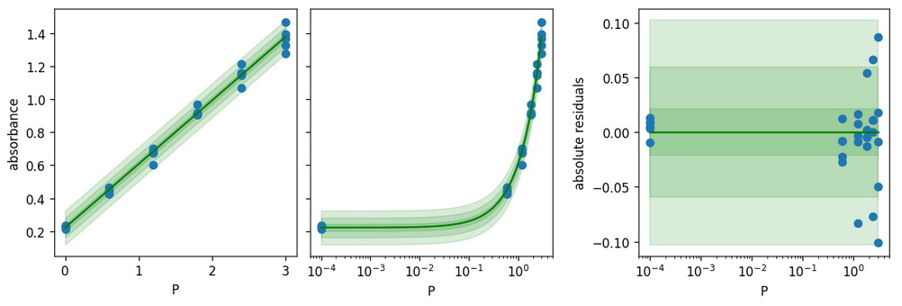
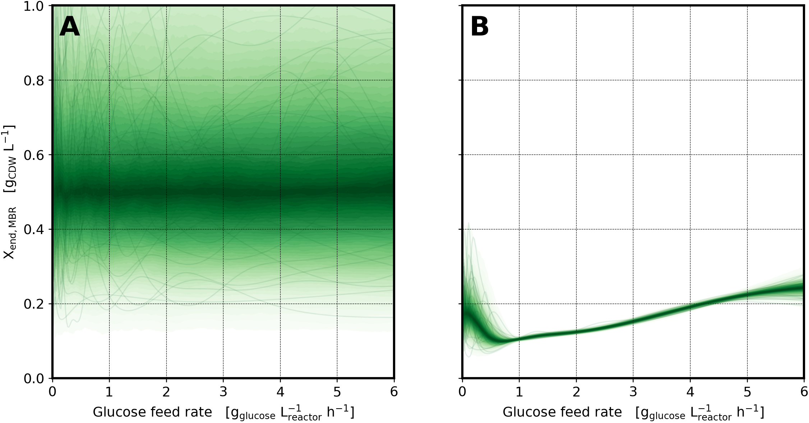

@import "style.css"

# Abstract

# Introduction

# Materials & Methods

## Bacterial Strain
*E. coli* BL21 (DE3) with a pETDuet plasmid (**I would give a reference for the plasmid**) with the carboxylase gene from  *Nocardia otitidiscaviarum* under the control of a T7-RNA-Promoter (**more detailed description??-> maybe only does it provide antibiotic resistant or similar and why you choose this plasmid (easy reporter for product formation!?)**) was used for all cultivations. The recombinant *E. coli* cells (**did you transform them yourself? Then a protocol should be given, maybe in supplementary, if not I would mention where you got the cells from e.g. kindly provided by XY**) were stored at -80 °C after mixing the cell suspension 1:1 with a 50% (v/v) glycerol solution.
## Media (**I'm personally not a fan of having separate sections for Media and Cultivations as it mostly leads to repetitions and informations you have to mention here that are first explained below**)
Seed cultures were grown with LB-Medium (5 g L<sup>-1</sup> yeast extract, 10 g L<sup>-1</sup> peptone, 5 g L<sup>-1</sup> NaCl, 50 mg L<sup>-1</sup> Ampicillin, pH 7.5) in 1 L shake flasks with a working volume of 100 mL. The pH of the LB-Medium was adjusted with 2 M NaOH prior to autoclaving (20 min at 121 °C). Sterile-filtered ampicillin  was added aseptically after autoclaving of the LB-Medium.

All cultivations on the mL and L-scales were carried out with a defined minimal medium [riesenberg1991high]. The final concentrations in the medium were as follows: 8.4 mg L<sup>-1</sup> ethylene-diamine-tetra-acetic acid (EDTA), 8.4 mg L<sup>-1</sup> CoCl<sub>2</sub>\*6H<sub>2</sub>O, 15 mg L<sup>-1</sup> MnCl<sub>2</sub>\*4H<sub>2</sub>O, 1.5 mg L<sup>-1</sup> CuCl<sub>2</sub>\*2H<sub>2</sub>O, 3 mg L<sup>-1</sup> H<sub>3</sub>BO<sub>3</sub>, 2.5 mg L<sup>-1</sup> Na<sub>2</sub>MoO<sub>4</sub>\*2H<sub>2</sub>O, 13 mg L<sub>-1</sub> Zn(CH<sub>3</sub>COO)<sub>2</sub>\*2H<sub>2</sub>O, 100 mg L<sup>-1</sup> Fe(III)citrate, 13.3 g L<sup>-1</sup> KH<sub>2</sub>PO<sub>4</sub>, 4 g L<sup>-1</sup> (NH<sub>4</sub>)<sub>2</sub>HPO<sub>4</sub>, 1.7 g L<sup>-1</sup> Citric acid\*H<sub>2</sub>O, 2.4 g L<sup>-1</sup> NaOH, 1.2 g L<sup>-1</sup> MgSO<sub>4</sub>\*7H<sub>2</sub>O, 50 mg L<sup>-1</sup> ampicillin . The pH was not adjusted prior to addition to the bioreactor. The initial glucose concentration was 5 g L<sup>-1</sup>. The feed medium consisted of 500 g L<sup>-1</sup> glucose with 12.5 g L<sup>-1</sup> MgSO<sub>4</sub> in fed-batch processes on an L-scale. For the mL-scale, the feed medium varied depending on the  applied feed rate. For the experiments with feed rate 4.8 g L<sup>-1</sup> h<sup>-1</sup> the feed medium consisted of 300 g L<sup>-1</sup> with 7.5 g L<sup>-1</sup> MgSO<sub>4</sub>. For the experiment with the feed rates from 2 to 4 g L<sup>-1</sup>h<sup>-1</sup>  the feed medium consisted of 200 g L<sup>-1</sup> with 5 g L<sup>-1</sup> MgSO<sub>4</sub>. For the experiment with the feed rates from 1 to 2 g L<sup>-1</sup> h<sup>-1</sup>  the feed medium consisted of 100 g L <sup>-1</sup> with 2.5 g L<sup>-1</sup> MgSO<sub>4</sub>. The varying feed concentrations were necessary to allow different feed rates with the same feed dosage frequency by the liquid handling system (LHS) without overfilling the reactors.

Prior to transfer of the cells from the L-scale to mL-scale, 0.5% (v/v) antifoam agent (Antifoam 204, Sigma-Aldrich / Merck KgaA, Darmstadt, Germany) was added aseptically. MgSO<sub>4</sub>\*7H<sub>2</sub>O, glucose and ampicillin were added aseptically after autoclaving of the medium. MgSO<sub>4</sub>\*7H<sub>2</sub>O and glucose were autoclaved separately, ampicillin was sterile-filtered.

## Seed culture
Seed culture preparation was performed in 1000 mL baffled shake flasks inoculated with 500 µL of the cryo-culture in 100 mL LB medium. The cells were grown for 7.5 h in a rotary shaker (Multitron, Infors, Bottmingen-Basel, Switzerland) at 150 rpm and 37 °C.
 
## Stirred-tank bioreactors
The cultivation procedure was adapted from von den Eichen et al. [von2021automated].
A parallel bioreactor system on an L-scale (DASGIP Parallel Bioreactor System, Eppendorf AG, Hamburg, Germany) with a working volume of 0.5 L was used for a cultivation consisting of a batch (initial glucose concentration 5 g L<sup>-1</sup>) and subsequent fed-batch (µ<sub>set</sub> = 0.1 h<sup>-1</sup>) phase to produce a sufficient cell density for the induction of the protein production. The bioreactor was equipped with a DO probe (Visiferm DO ECS 225 H0, Hamilton Bonaduz AG, Bonaduz, Switzerland). The fed-batch phase was started automatically based on the slow decline of the dissolved oxygen (DO) signal followed by a steep rise above 75% during the batch phase. The pH was controlled at pH 7.0 with a pH probe (EasyFerm Plus PHI K8 225, Hamilton Bonaduz AG, Bonaduz, Switzerland). The exponential feeding was stopped after 23 h process time at a a cell density > 10 g L<sup>-1</sup> to make sure that the final dry cell mass in the subsequently used stirred-tank bioreactors will not exceed 40 g L<sup>-1</sup> to avoid any disturbance of the fluorometric pH sensors. [faust2014feeding]
After 23 h process time the cell broth from the L-scale bioreactor was automatically transferred to a bioreaction unit with 48 mL-scale bioreactors (bioREACTOR48, 2mag AG, Munich, Germany). The transfer procedure has been described in von den Eichen et al. [von2021automated]. Due to more time-efficient pump control compared to our previous publication, the total time needed for the transfer was reduced reduced to approximately 25 minutes. Sterile single-use bioreactors with a working volume of 10 mL with baffles (HTBD, 2mag AG, Munich, Germany) with fluorometric spots for online DO and pH measurement were used for all experiments (PSt3-HG spot for DO, LG1 spot for pH,  PreSens GmbH, Regensburg, Germany).
The bioreaction unit was placed on the working table of a liquid handling system (LHS, Microlab STARlet, Hamilton Bonaduz AG, Bonaduz, Switzerland) equipped with 8 pipetting channels, a plate handler, two tools for automatic opening of special reaction tubes (FlipTubes, Hamilton Bonaduz AG, Bonaduz, Switzerland), a microtiter plate washer (405 LS, Biotek, Winooski, USA), a microtiter plate reader (Synergy HTX, Biotek, Winooski, USA) and a plate heater/shaker (Hamilton Heater Shaker, Hamilton Bonaduz AG, Bonaduz, Switzerland).
The headspace of each bioreactor was rinsed with 0.1 L min<sup>-1</sup> sterile air that was enriched with water. The headspace was cooled to 20 °C to reduce evaporation during operation. The stirrer speed was constant at 3000 rpm throughout all cultivations. At an mL-scale a fed-batch process with varying constant feed rates was conducted. Substrate solution was added intermittently by the LHS with a frequency of 6 h<sup>-1</sup>. The feed solution consisted of glucose (100 - 300 g L<sup>-1</sup>) and MgSO<sub>4</sub> (2.5 - 7.5 g L<sup>-1</sup>) with varying concentrations to allow for dosing intervals at a minimum dosage volume of 14 µL. The pH was controlled individually at pH 6.9 by the addition of 12.5 % (v/v) NH<sub>3</sub>. To save LHS time, the pH correction was applied for all eligible reactors, i.e. when 12 out of 48 bioreactors showed a pH deviation, 12.5 (v/v) NH<sub>3</sub> was added to all 12 reactors. The frequency at which the LHS started these pH control procedures was 6 h<sup>-1</sup>.

Isopropyl ß-D-1-thiogalactopyranoside (IPTG) with a final concentration in the reactors from 0.24 to 32 µM was added by the LHS to induce recombinant gene expression one hour after the fed-batch processes had been initiated on the mL-scale. The IPTG stock solutions were stored in closed 1.5 mL reaction tubes on the LHS workspace. During the IPTG addition procedure, the LHS opened and closed the reaction tubes automatically. IPTG concentrations were calculated based on the initial reaction volume of 10 mL.
The cultivations on the L-scale were just followed by sensor data, whereas samples on the mL-scale generally taken every hour by the LHS, with two exceptions: a) the first and the second sample were taken at 0.083 h and 1.25 h, respectively b) the last three samples were taken every two hours.
To ensure sterile operation of the LHS, the pipetting needles of the LHS were washed with an aqueous solution of 70 % (v/v) ethanol and with sterile filtered deionised water after each pipetting step.
All tasks (substrate addition, pH control, inductor addition, sampling) were initiated by a priority-based scheduler which weighed the tasks based on their real-time priority to enable optimal process control when more than one task was eligible (**maybe add some more information**). 
The priorities were feed > inductor addition > sampling > pH control.

## Analytical Procedures
Sampling for the measurement of the optical density was conducted automatically by the LHS. Initially, samples of 150 µL were pipetted in a microtiter plate. All samples were diluted sequentially in a second microtiter plate 1:10 and 1:100 with phosphate-buffered saline (PBS, 8 g L<sup>-1</sup> NaCl, 0.2 g L<sup>-1</sup> KCl, 1.44 g L<sup>-1</sup> Na<sub>2</sub>HPO<sub>4</sub>, 0.24 g L<sup>-1</sup> KH<sub>2</sub>PO<sub>4</sub>). The 1:100 diluted samples were used to measure the optical density at 600 nm (OD<sub>600</sub>). Afterwards, both microtiter plates were washed with a microtiter plate washer (405 LS, Biotek, Winooski, USA) operated by the LHS. The sample liquids were initially aspirated and discarded followed by three dispensing and aspiration steps with 300 µL deionised water with 0.1 % (v/v) tween (Tween 20, Amresco, Solon, USA).
To estimate the dry cell weight (DCW) concentration in the stirred-tank bioreactors on an mL-scale, a linear correlation between OD<sub>600</sub> and DCW concentration was prepared. For DCW determinations, 3 samples with 2 mL of culture broth were withdrawn at L-scale during fed-batch operation and centrifuged for 5 min at 14.930 g in pre-dried and pre-weighed culture tubes. The pellet was dried for at least 24 h at 80 °C before weighing (**something does not fit here, did you use DCW measurement in L scale and correlate it to OD measurement on mL scale? Maybe re-formulate to clarify**).


## Biotransformation (**this whole subsection is a bit hard to follow**)
The used biotransformation procedure is adapted from Schwendenwein et al. [schwendenwein2019random]
The biotransformations were conducted automatically at the end of the mL-scale process in a deep-well-plate with a working volume of 1 mL. Therefore, all liquid and labware handling steps were conducted automatically by the LHS (**this sentence is repititon, can be integrated in the previous one**). (**given there is enough space, I would first here mention which reaction you are looking at to facilitate following the different steps**). For all 48 sample positions, 25 µL cells from the stirred-tank bioreactors on the mL-scale were mixed with 250 µL 10 µM 3-Hydroxybenzoic acid dissolved in PBS, 500 µL defined mineral (**mineral or minimal? or both?**) medium (see section "Media") with 10 g L<sup>-1</sup> glucose and 225 µL PBS.
For each parallel experiment, three calibration curves were generated. Each calibration curve includes six different product concentrations. Basically, the educt solution (3-Hydroxybenzoic acid) was replaced with different amounts of a product solution (12 mM 3-Hydroxybenzoic aldehyd dissolved in PBS) to achieve a final product concentration in the DWP (**abbreviation is not introduced**) ranging from 0 to 3 mM. To have identical volumes in all calibration wells, the wells were filled up to 1 mL with PBS after the addition of cell solution and mineral medium. The biomass for all calibration curves was aspirated from the first (A1) bioreactor position of the respective experiment.
All solutions required for the biotransformation were prepared freshly for each experiment.

After preparing the initial reaction mixture for the biotransformations, the deep-well-plate was shaken at 35 °C and 1000 rpm (Hamilton Heater Shaker, Hamilton Bonaduz AG, Switzerland). Every 1.1 hours, 50 µL of all positions (48 sample positions and 18 calibration positions) was transferred to a microtiter plate and mixed with 50 µL ABAO-Solution (2-amino benzamidoxime)(**first name, then abbreviation**). The ABAO solution consisted of 10 mM ABAO dissolved in sodium acetate buffer (3.69 g L<sup>-1</sup> sodium acetat, 3.15 % (v/v) acetic acid, 5% (v/v) dimethyl sulfoxide, pH adjusted to 4.5). Afterwards, the microtiter plate was incubated at room temperature for 45 minutes and measured photometrically at 360 nm and 600 nm in a microtiter plate reader (Synergy HTX, Biotek, Winooski, USA). The microtiter plate was washed with a microtiter plate washer (405 LS, Biotek, Winooski, USA) operated by the LHS. The sample liquids were initially aspirated and discarded followed by three dispensing and aspiration steps with 300 µL deionised water with 0.1 % (v/v) tween (Tween 20, Amresco, Solon, USA). Finally, the remaining wash solution was aspirated and discarded and the microtiter plate was transferred by the LHS to its origin position. 
A total of 5 measurements including a measurement directly after biotransformation start were conducted.

## Data processing
The dataset exported from the laboratory automation platform was processed into a set of tabular `DataFrame` structures using `pandas` [pandas].
Every unique combination of glucose feed rate and IPTG concentration was assigned a unique identifier (`design_id`) for identification inside the model.
Likewise, every biotransformation reaction was assigend a `replicate_id`.
The association between all experiment designs, biotransformation reactions and relevant metainformation such as assay well positions was tracked in a tabular form ("df_layout" sheet in `dataset.xlsx`).
Reference wells of known product concentration were equally included in the dataset, hence the layout table includes a sparse column for known product concentrations.

Measurements of absorbance at 360 and 600&nbsp;nm were were kept in separate tables ("df_360" and "df_600" in `dataset.xlsx`), organized by the previously assigned `replicate_id`.


# Results & Discussion

## Experimental data


## Raw process data


## Calibration models
### Biomass concentration
The separately acquired biomass calibration dataset was used to fit two models describing the relationship between biomass cell dry weight and absorbance at 360 and 600&nbsp;nm respectively.



__Figure 1: Biomass [g/L] calibration at 360 nm.__ The spread of observations (🔵) is modeled by a `calibr8.LogIndependentAsymmetricLogisticN` model with `scale_degree=1` to account for non-linearity (left) and heteroscedasticity (right). Green bands depict the intervals of 97.5, 95 and 84&nbsp;% probability of observations according to the model.



__Figure 2: Biomass [g/L] calibration at 600 nm.__ Observations (🔵) at 600&nbsp;nm indicated lower absorbance compared to 360&nbsp;nm. Like for 360&nbsp;nm, the model is a `calibr8.LogIndependentAsymmetricLogisticN` model with `scale_degree=1`.

The models were built with the `calibr8` package [calibr8] using an asymmetric logistic function of the logarithmic biomass concentration to describe the mean of normally distributed absorbance observations.
Since the absorbance/biomass relationship exhibits a heteroscedastic noise, the scale parameter of the Normal distribution was modeled as linearly dependent on the mean.

### Product concentration
The ABAO reaction was performed to quantify 2-amino benzaldehyde.
The absorbance of its reaction product was measured at 360&nbsp;nm in all assays.
A separate calibration dataset was obtained by performing the assay procedure on reference samples with known 2-amino benzaldehyde concentrations.
Reference samples were prepared without biomass and with different amounts of acetic acid to exclude biomass absorbance, and investigate pH robustness of the method.

A linear calibration model with scale and $\nu$ parameters of the Students-*t* distribution as constants was fitted to the 360&nbsp;nm measurements of product calibration samples.



__Figure 3: Product calibration at 360 nm.__ In the observed range, the absorbances at 360&nbsp;nm (🔵) followed a linear trend in dependence on the 2-amino benzaldehyde concentration. The model was built from a `calibr8.BasePolynomialModelN` model with `mu_degree=1` and `scale_degree=0`.

All calibration model parameters were estimated by maximum likelihood using SciPy optimizers.
For code and reproducable Jupyter notebooks of this analysis we refer to the accompanying GitHub repository.

## Process model
The dataset of biotransformation reactions was modeled in a generative hierarchical Bayesian framework using the probabilistic programming language PyMC [pymc3,pymcZenodo].
This model closely resembles the biotechnological process that generated the dataset, therefore we call it *process model* henceforth.
Starting from input parameters such as specific activity, random effects or dependence of final 10&nbsp;mL reactor biomass concentration on glucose feed rate the process model simulates biomass and 2-amino benzaldehyde concentrations in each biotransformation well across all experiments.

A likelihood needed for parameter inference by Markov-chain Monte Carlo (MCMC) is created from process model predictions and observed absorbances according to relationships described by the separately fitted calibration models $\phi_\mathrm{cm,X,600\ nm}$, $\phi_\mathrm{cm,X,360\ nm}$ and $\phi_\mathrm{cm,P,360\ nm}$.
At 600&nbsp;nm this is the likelihood of the observed data given the predicted biomass concentration $X$.
At 360&nbsp;nm however, both biomass $X$ and ABAO reaction product absorb and therefore the sum of their absorbances needs to be taken into account for the likelihood.

Note that while it is the ABAO reaction product that contributes absorbance at 360&nbsp;nm we performed the ABAO assay calibration with known 2-amino benzaldehyde concentrations, so the corresponding model $\phi_\mathrm{cm,P,360\ nm}$ describes 360&nbsp;nm ABAO reaction product absorbance as a function of 2-amino benzaldehyde concentration.
For simplicity we therefore use the symbol $P$ to refer to the product of interest concentration: 2-amino benzaldehyde in the biotransformation solution.

$$
\begin{aligned}
    \mathcal{L_\Sigma} &= \mathcal{L}_\mathrm{600\ nm}(\mathrm{A_{600\ nm}} \mid \mathrm{A_{600\ nm,obs}}) \cdot \mathcal{L}_\mathrm{360\ nm}(\mathrm{A_{360\ nm}} \mid \mathrm{A_{360\ nm,obs}}) \\
    \textrm{where} \\
    \mathrm{A_{600\ nm}} &\sim Normal(\mathrm{\mu_{X,600\ nm}}, \mathrm{\sigma_{X,600\ nm}}) \\
    (\mathrm{\mu_{X,600\ nm}}, \mathrm{\sigma_{X,600\ nm}}) &= \phi_\mathrm{X,600\ nm}(X) \\
    \mathrm{A_{360\ nm}} &\sim Normal(\mathrm{\mu_{360\ nm}}, \mathrm{\sigma_{360\ nm}}) \\
    \mathrm{\mu_{360\ nm}} &= \mathrm{\mu_{X,360\ nm}} + \mathrm{\mu_{P,360\ nm}} \\
    \mathrm{\sigma_{360\ nm}} &= \sqrt{\mathrm{\sigma_{X,360\ nm}}^2 + \mathrm{\sigma_{P,360\ nm}}^2} \\
    (\mathrm{\mu_{X,360\ nm}}, \mathrm{\sigma_{X,360\ nm}}) &= \phi_\mathrm{cm,X,360\ nm}(\mathrm{\vec{X}_{\vec{t},\vec{replicate}}}) \\
    (\mathrm{\mu_{X,360\ nm}}, \mathrm{\sigma_{X,360\ nm}}) &= \phi_\mathrm{cm,P,360\ nm}(\mathrm{\vec{P}_{\vec{t},\vec{replicate}}}) \\
\end{aligned}
$$

The above observation model applies to biomass $X$ and 2-amino benzaldehyde concentration $P$ _at every time point_, _in every replicate_ of either a biotransformation reaction or reference sample.
Reference wells of known product concentrations, but without 2-amino benzoic acid are also included in the model, albeit with the assumption that the 2-amino benzaldehyde concentration remains constant over time.

$$
\begin{aligned}
    \mathrm{\vec{X}_{\vec{t},\vec{replicate}}} &= \{ \mathrm{\vec{X}_{\vec{t},\vec{reference}}}, \mathrm{\vec{X}_{\vec{t},\vec{DWP}}}\} \\
    \mathrm{\vec{P}_{\vec{t},\vec{replicate}}} &= \{ \mathrm{\vec{P}_{(\vec{t}),\vec{reference}}}, \mathrm{\vec{P}_{\vec{t},\vec{DWP}}}\} \\
\end{aligned}
$$

The process model to describe these _per replicate_ and _per time point_ concentrations is described in the following sections.

Since almost all process model variables are vectors or matrices, we denote dimensions by subscripts with arrows.
For example, the notation $\vec{X}_{\vec{t},\vec{DWP}}$ or $\vec{P}_{\vec{t},\vec{DWP}}$ should be interpreted as 2-dimensional variables (matrices) with entries for each combination of time point and DWP well.
The meanings of dimension symbols is summarized in the following table.

| symbol | dimension length | variable has elements for each of the... |
| - | - | - |
| $\vec{DASGIP}$ | 4 | DASGIP reactor batches. |
| $\vec{2mag}$ | 191 | 2mag reactor vessels. |
| $\vec{DWP}$ | 191 | DWP wells with active biotransformations. |
| $\vec{replicate}$ | 263 | DWP wells, which includes biotransformation and reference wells. |
| $\vec{t}$ | 5 | time points at which observations were made. |
| $\vec{glc}$ | 6 | glucose feed rates investigated. |
| $\vec{IPTG}$ | 25 | IPTG concentrations investigated. |
| $\vec{design}$ | 42 | unique combinations of glucose feed rate & IPTG concentration. |


### Biomass process model
The biomass in the experiment is sourced from a "seed train" of cultivations in three different scales and operating modes:
1. $1\ L$ DASGIP batch bioreactor; 1 per experiment run.
2. $10\ mL$ 2mag fed-batch macrobioreactor; 48 per experiment run.
3. $1\ mL$ biotransformation in square deep-well plate; 60 per experiment run. **I think 60 is wrong, it should be 48 + (6*3)=66 (NE)**

The process model must describe biomass in each biotransformation well so it can be accounted for in the 360&nbsp;nm absorbance.
Since a universally activity metric, that can be interpredeted independent from experimenteal batch effects is desired, the model must additionally describe biomass in a way that excludes random batch effects.
The first process stage at which such an experiment-independent prediction is needed, is the final biomass concentration of the 1&nbsp;L batch cultivation.

Concretely, we describe the per-experiment final biomass concentration at the 1&nbsp;L scale as a LogNormal-distributed variable called $\mathrm{\vec{X}_{end,\vec{DASGIP}}}$ with an entry for each experiment run.
To obtain an experiment-independent prediction, we introduced $\mathrm{X_{end,batch}}$ as a _group mean prior_, also known as a _hyperprior_, around which the $\mathrm{\vec{X}_{end,\vec{DASGIP}}}$ is centered.
The prior on $\mathrm{X_{end,batch}}$ is weakly (large $\sigma$) centered at $0.5\ g/L$, whereas actual batches should only deviate from that group mean by ca. $5\ \%$.

$$\begin{aligned}
    \mathrm{X_{end,batch}} &\sim LogNormal(\mu=ln(0.5), \sigma=0.5)\\
    \mathrm{\vec{X}_{end,\vec{DASGIP}}} &\sim LogNormal(\mu=ln(\mathrm{X_{end,batch}}), \sigma=0.05)
\end{aligned}$$

This hierarchical structure is a common motif in Bayesian modeling since it enables a model to learn variables that are essential to the process understanding (here: $\mathrm{X_{end,batch}}$) while retaining the ability to describe the fine-grained structure of the experimental data (here: $\mathrm{\vec{X}_{end,\vec{DASGIP}}}$).
The motif of hierarchically modeled variables was used in several places of our bioprocess model.
For a thorough introduction to hierarchical modeling, we recommend [betancourt2020].

The second process stage in the biomass seed train is the expression in 10&nbsp;mL scale under fed-batch conditions.
Every 10&nbsp;mL 2mag reactor was inoculated with culture broth from a DASGIP reactor, hence a mapping $f_\mathrm{\vec{DASGIP} \rightarrow \vec{2mag}}$ yields initial biomass concentrations $\mathrm{\vec{X}_{start,\vec{2mag}}}$ by sub-indexing the $\mathrm{\vec{X}_{end,\vec{DASGIP}}}$ variable.
The experimental design of the fed-batches comprised varying glucose feed rates and IPTG concentrations.
It is plausible to assume a dependence of the final biomass concentration $\mathrm{\vec{X}_{end,\vec{2mag}}}$ on the glucose feed rate.
Without any mechanistic assumptions, we lump the final biomass concentration per 1&nbsp;mL reactor as the product of initial biomass concentration with a positive factor $\mathrm{\vec{X}_{factor,\vec{glc}}}$ that depends on the glucose feed rate.
Dependence of $\mathrm{\vec{X}_{factor,\vec{glc}}}$ on the glucose feed rate is modeled by a Gaussian process such that our model can also interpolate and make predictions for new glucose feed rate settings.

$$
\begin{aligned}
    \mathrm{\vec{X}_{start,\vec{2mag}}} &= f_\mathrm{\vec{DASGIP} \rightarrow \vec{2mag}}(\mathrm{\vec{X}_{end,\vec{DASGIP}}}) \\
    \mathrm{\vec{X}_{end,\vec{2mag}}} &= \mathrm{\vec{X}_{start,\vec{2mag}}} \cdot f_{\mathrm{\vec{glc} \rightarrow \vec{2mag}}}(\mathrm{\vec{X}_{factor,\vec{glc}}}) \\
    \textrm{with} \\
    ln(\mathrm{\vec{X}_{factor,\vec{glc}}}) &= f_\mathrm{\vec{lnX}_{factor,\vec{glc}}}(log_{10}(\vec{D}_\mathrm{design,\vec{glc}})) \\
    f_\mathrm{\vec{lnX}_{factor,\vec{glc}}}(d) &\sim GP(0, k(d,d')) \\
    k(d,d') &= \sigma^2 \cdot e^{-\frac{(d-d')^2}{2\ell^2}} \\
    \sigma &\sim LogNormal(ln(0.3), 0.1) \\
    \ell &\sim LogNormal(ln(0.34), 0.1)
\end{aligned}
$$

The Gaussian process was parametrized with a mean function of $0$, thereby centering the prior for $\mathrm{\vec{X}_{factor,\vec{glc}}}$ around $1$.
For the covariance function we chose a scaling parameter $\sigma$ such that the prior variance for the factor is around $\pm30\ \%$.
The prior for $\ell$ in the exponential quadratic kernel encodes a belief that $\mathrm{\vec{X}_{factor,\vec{glc}}}$ varies smoothly on a length scale of around half of the (logarithmic) design space.



__Figure 4: Prior and posterior of feedrate-dependent final fed-batch biomass concentration.__
Before observing the data (prior, left) the model predicts a broad distribution of functions (thin lines) that could describe the relationship between feed rate and final fedbatch biomass concentration. After observing the data (posterior, right), the final biomass turned out lower than expected, but the distribution of possible relationships is much narrower. Only outside of the experimentally investigated range of 1-4.8&nbsp;g/L the uncertainty increases again.

The 3rd and final process stage is the biotransformation.
Here, the initial biomass concentration in every DWP replicate well $\mathrm{\vec{X}_{0,\vec{replicate}}}$ equals the final biomass concentration from a corresponding 10&nbsp;mL reactor.
The biomass concentration continued to change over the course of the biotransformation, because the solution also contained glucose as a carbon source.
Inspired by the $\mu(t)$ method described in [blet] we account for this biomass growth during the biotransformation with a Gaussian random walk of the discretized growth rate $\vec{\mu}_{\vec{t},\vec{replicate}}$.
The result are biomass concentrations for every replicate well and measurement cycle $\mathrm{\vec{X}_{\vec{t},\vec{replicate}}}$.

$$
\begin{aligned}
    \mathrm{\vec{X}_{0,\vec{replicate}}} &= f_\mathrm{\vec{2mag}\rightarrow \vec{replicate}}(\mathrm{\vec{X}_{end,\vec{2mag}}}) \\
    \mathrm{\vec{X}_{t \ge 1,\vec{replicate}}} &= \mathrm{\vec{X}_{0,\vec{replicate}}} \cdot e^{cumsum(\vec{\mu}_{\vec{t},\vec{replicate}} \cdot \vec{dt}_{\vec{t},\vec{replicate}})}\\
    \vec{\mu}_{\vec{t},\vec{replicate}} &\sim GaussianRandomWalk(\sigma=0.1) \\
\end{aligned}
$$

### Biotransformation reaction process model
Next to biomass, the second important contributor to observed absorbances is the 2-amino benzaldehyde concentration $\mathrm{\vec{P}_{\vec{t},\vec{replicate}}}$ that reacted with ABAO.
In the reference samples this concentration $\vec{P}_{(\vec{t}),\vec{reference}}$ is known and assumed constant.
For the remaining wells it is the reaction product concentration of the biotransformation $\mathrm{\vec{P}_{\vec{t},\vec{DWP}}}$.
Here we assume an initial product concentration $P_0=0$ and model the biotransformation reaction as a 1st order reaction starting from a global initial benzoic acid concentration $S_0$ with an initial rate coefficient $\vec{k}_{0,\vec{DWP}}$.

$$
\begin{aligned}    
    \vec{P}_{\vec{t},\vec{DWP}} &= S_0 \cdot (1 - e^{-\vec{t}_\mathrm{actual,\vec{DWP}} \cdot \vec{k}_{\vec{t},\vec{DWP}} \cdot \mathrm{\vec{X}_{\vec{t},\vec{DWP}}}}) \\
    \vec{t}_\mathrm{actual,\vec{DWP}} &= \vec{t}_\mathrm{recorded,\vec{DWP}} + t_\mathrm{delay} \\
    t_\mathrm{delay} &\sim HalfNormal(\sigma = 0.1)
\end{aligned}
$$

This well-wise rate coefficient $\vec{k}_{\vec{t},\vec{DWP}}\ [mM/h]$ depends on three factors.
The first is the concentration of the whole-cell biocatalyst $\vec{X}_{\vec{t},\vec{DWP}}\ [g_{CDW}]$ as obtained from the biomass model described above.
The second factor is the biocatalyst' specific activity $\vec{k}_\mathrm{\vec{design}}\ [mM/h/g_{CDW}]$ that depends on the experimental design of the expression phase.
The third factor is a batch-wise random effect $\vec{F}_{\vec{DASGIP}}\ [-]$ to account remaining experimental variability.

$$
\begin{aligned}
    \vec{k}_{\vec{t},\vec{DWP}} &\sim LogNormal( ln(\mu_{\vec{k}_{\vec{t},\vec{DWP}}}), 0.05)  \\
    \mu_{\vec{k}_{\vec{t},\vec{DWP}}} &= \mathrm{\vec{X}_{\vec{t},\vec{DWP}}} \cdot f_1(\vec{k}_\mathrm{\vec{design}}) \cdot f_2(\vec{F}_\mathrm{\vec{DASGIP}}) \\
    \vec{F}_\mathrm{\vec{DASGIP}} &\sim LogNormal(0, 0.1) \\
    \textrm{with} \\
    f_1 &: \vec{design} \rightarrow \vec{DWP} \\
    f_1 &: \vec{DASGIP} \rightarrow \vec{DWP} \\
\end{aligned}
$$

For the overall bioprocess optimization study we were interested in two quantities:
Design-wise specific activity $\vec{k}_{\vec{design}}$ and an experiment-independent absolute initial reaction rate $\vec{v}_{0,\vec{design}}$.
The $\vec{k}_{\vec{design}}$ parameter is part of the above equation and modeled by a two-dimensional Gaussian process to allow for inter- and extrapolation to new experimental designs.

$\vec{k}_{\vec{design}}$ is strictly positive and we expect it around $0.1-0.8\ [mM/h]$.
The model described below achieves both properties by describing a GP for $ln(\vec{k}_{\vec{design}})$ and assigning a corresponding prior for the kernel variance $\sigma$.
The prior for lenghtscales $\vec{\ell}$ was centered on the 1/2 of the $log_{10}$ range (upper minus lower bound) of the design space.
A similar structure was used earlier for the $\mathrm{\vec{X}_{factor,\vec{glc}}}$ variable in the upstream biomass model.

$$
\begin{aligned}
    ln(\vec{k}_{\vec{design}}) &= f_{\vec{logk}_{\vec{design}}}(log_{10}(\vec{D}_{\vec{design}})) \\
    f_{\vec{logk}_{\vec{design}}}(d) &\sim GP(0, k(d,d')) \\
    k(d,d') &= \sigma^2 \cdot e^{-\frac{(d-d')^2}{2\vec{\ell}^2}} \\
    \sigma &\sim LogNormal(ln(0.7), 0.2) \\
    \vec{\ell} &\sim LogNormal(ln(\mathrm{\vec{range}}), 0.1) \\
    \vec{\mathrm{range}} &= (0.681, 2.125)^T
\end{aligned}
$$

Finally, the initial reation rate metric $\vec{v}_{0,\vec{design}}\ [mM/h]$ is derived from model parameters that do not depend on batch/reactor/replicate-specific variables:

$$
\begin{aligned}
    \vec{v}_{0,\vec{design}} &= \vec{k}_{\vec{design}} \cdot \mathrm{\vec{X}_{end,\vec{design}}} \\
    \mathrm{\vec{X}_{end,\vec{design}}} &= \mathrm{X_{end,batch}} \cdot \mathrm{\vec{X}_{factor,\vec{glc}}}
\end{aligned}
$$


# Acknowledgements

# References
```bibtex
@misc{betancourt2020,
    title={Hierarchical Modeling},
    author={Betancourt, Michael},
    year={2020},
    url={https://betanalpha.github.io/assets/case_studies/hierarchical_modeling.html}
}
@article{riesenberg1991high,
  title={High cell density cultivation of Escherichia coli at controlled specific growth rate},
  author={Riesenberg, D and Schulz, V and Knorre, WA and Pohl, H-D and Korz, D and Sanders, EA and Ross, A and Deckwer, W-D},
  journal={Journal of biotechnology},
  volume={20},
  number={1},
  pages={17--27},
  year={1991},
  publisher={Elsevier}
}

@article{schwendenwein2019random,
  title={Random Mutagenesis-Driven Improvement of Carboxylate Reductase Activity using an Amino Benzamidoxime-Mediated High-Throughput Assay},
  author={Schwendenwein, Daniel and Ressmann, Anna K and Doerr, Mark and H{\"o}hne, Matthias and Bornscheuer, Uwe T and Mihovilovic, Marko D and Rudroff, Florian and Winkler, Margit},
  journal={Advanced Synthesis \& Catalysis},
  volume={361},
  number={11},
  pages={2544--2549},
  year={2019},
  publisher={Wiley Online Library}
}

@article{von2021automated,
  title={Automated multi-scale cascade of parallel stirred-tank bioreactors for fast protein expression studies},
  author={Von den Eichen, Nikolas and Bromig, Lukas and Sidarava, Valeryia and Marienberg, Hannah and Weuster-Botz, Dirk},
  journal={Journal of Biotechnology},
  volume={332},
  pages={103--113},
  year={2021},
  publisher={Elsevier}
}

@article{faust2014feeding,
  title={Feeding strategies enhance high cell density cultivation and protein expression in milliliter scale bioreactors},
  author={Faust, Georg and Janzen, Nils H and Bendig, Christoph and R{\"o}mer, Lin and Kaufmann, Klaus and Weuster-Botz, Dirk},
  journal={Biotechnology journal},
  volume={9},
  number={10},
  pages={1293--1303},
  year={2014},
  publisher={Wiley Online Library}
}


```
